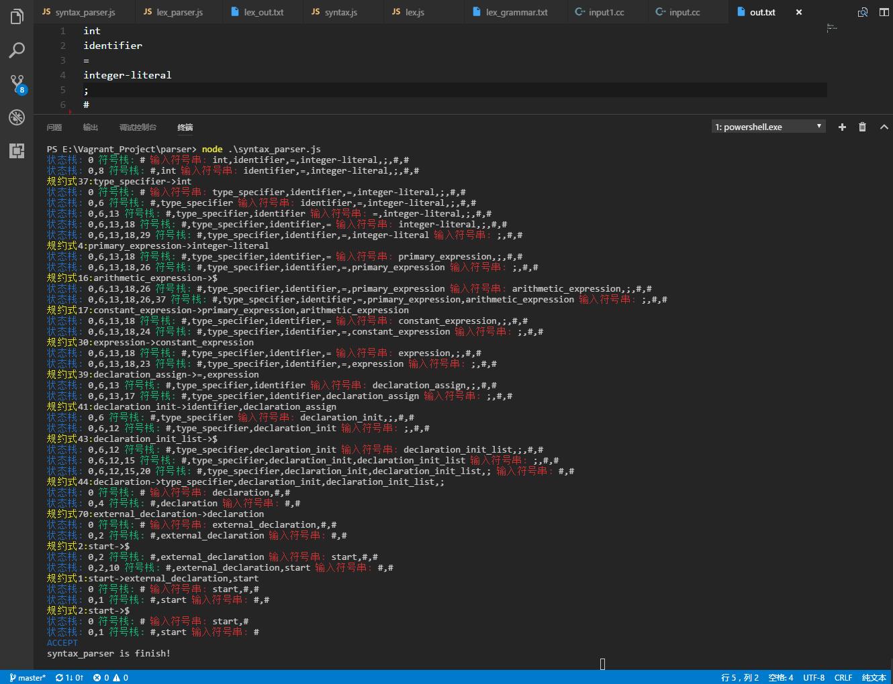

# Compilers

## 项目说明
+ 编译原理课程设计，要求完成词法和语法分析，采用ES6(javascript)编写
+ 编程语言: ES6 (javascript)
+ 运行环境: nodejs v6.10.0

### 运行说明:

```markdown
1. 执行 git clone https://github.com/yangsuper666/Compilers.git 克隆项目

2. 进入项目后执行 npm install 安装包主要为express和colors(编写代码时方便显示信息)

3. 先将待分析词法输入input.cc文件中,执行 node lex_parser.js !在浏览器中输入localhost:3000可以查看生成的dfa，输入localhost:3000/nfa可以查看到生成的nfa

4. 词法分析接受后执行node syntax_parser.js 在终端可以看到输出的分析表，同样访问localhost:3000可以查看生成的项目集,输入localhost:3000/action可以查看action表,输入localhost:3000/goto可以查看goto表
```

### 文件说明

   现在主要包括四个文件 ```lex.js``` ```lex_parser.js``` ```syntax.js``` ```syntax_parser.js``` 分别进行词法，语法分析。

### 词法分析说明

   选择由正规文法产生NFA,然后将DFA转化为NFA。

### 语法分析说明

​    采用LR(1)来进行语法分析。在开始写语法分析，我发现构造语法文法是比较难的,我从学长的介绍找到了[http://www.nongnu.org/hcb/](http://www.nongnu.org/hcb/) 来写了一个简单的2型文法,但是只能分析简单的类C语言代码。

## 样例

### 词法分析


```input.cc```源文件(部分)

```c
int a1 ++;
double b = 2.3;
int a = 1, b = 234 , c = 2e4;
function int max(int a,int b){
    if ( a>b ) return  a;
    else return b;
}
```

```lex_out.txt```词法分析结果

```markdown
1:1 int int
1:2 identifier a
1:3 = =
1:4 integer-literal 1
1:5 ; ;
2:1 int int
2:2 identifier b
2:3 = =
2:4 integer-literal 1
2:5 ; ;
3:1 int int
3:2 identifier c
3:3 = =
3:4 identifier a
3:5 + +
3:6 identifier b
3:7 ; ;
```

```dfa```


```nfa```


### 语法分析 

```ACCEPT```



```ERROR```


```项目集```


```action```


```goto```


## 代码说明

### 词法分析代码说明

+ ```lex.js```代码说明

```javascript
function Lex() {
    this.nfa = {};
    this.dfa = {};
    this.tokens = [];
    this.vn = new Set();                              // set存非终结符
    this.vt = new Set();                              // set存终结符 
    this.keyword = new Set();                         // 关键字
    this.type = new Set();                            // 类型
    this.tokenName = new Set(['identifier', 'integer-literal', 'real-literal', 'science', 'string']);
    this.nfaBegin = 'begin';
    deal = function(element) {};                      // 私有函数处理空格
    hashSet = function(dataSet){};		              // js没有像py的hash函数，所以手写一个生成唯一id标记dfa
    moveTo = function(vt, State, nfa){};              // NFA->DFA时采用的moveTo()
    this.transNFA = function(grammer, endName){};     // 生成NFA
    this.transDFA = function(){};                     // NFA->DFA
    this.getToken = function(input, row){};           // 在lex_parser.js中调用产生token
    this.setKeyword = function(keyword){};            // 在lex_parser.js中调用设置关键字
    this.setType = function(type){};		          // 在lex_parser.js中调用设置类型
    this.logNFA = function(){};			              // 输出NFA图
    this.logDFA = function(){};                       // 输出DFA图
}
```

+ ```lex_parser.js```执行流程

```markdown
一.采用node.js的内置读写文件模块fs对lex_grammar.txt进行读入，在读入的同时进行NFA的构建，NFA的构建用lex.js中的 transNFA() 来实现。正规文法生成NFA较为简单，详情看代码便很清楚。

二.将生成的NFA转换成DFA,根据编译原理(清华大学)版p58页的算法描述实现。
	1.由于文法设定为正规文法，所以构建的NFA图中不包含空弧，所以就省去了求闭包的部分
	2.首先我先构建了一个begin节点，由该节点来作为开始节点生成DFA
	3.因为js语言中没有hash函数，所以编写了hash函数用Set来存储节点的子集名，hash后生成的id即由各个界符，关键字，	  类型组成。
	4.遍历词法中的终结符，采用moveTo函数进行检索，生成新的DFA节点，直至无新的DFA产生。

三.采用fs对输入的代码段进行token获取
	1.lex_parser.js对input.cc进行读取，然后采用lex中的getToken将输入代码进行token分析
	2.读入代码，一个字符一个字符处理在自动机里跑，识别关键字，界符，类型， 变量名等等。
	3.将产生的token写到lex_out.txt文件中。
	4.如果有错误，则token将不会把token写到lex_out.txt中。并能将错误位置显示出来。
```

### 语法分析代码说明

+ ```syntax.js```说明

```javascript
// 一个项目
let src = { 
    index : 0,            // 文法产生式id
    pos : 0,              // 圆点位置
    fro : new Set(['#']), // first(βa)
    length : 1,           // 文法产生式长度
    hash : hash           // 项目hash值
};
// 项目集族
this.projectSet = [{
 	id: 0,
	set: [{index: 0, pos: 0, fro: Set(), length: 1, hash: "0&0&([#])&1"}, ...], // 存储项目
	next: { L: [ 1 ], *: [ 2 ]},  // 存储状态转换后next的id
        isacc : false                 // acc               
},...]
function Syntax() {
    this.vn = new Set();   // 记录非终结符
    this.vt = new Set();   // 记录终结符
    this.v = new Set();    
    this.firstSet = {};    // first集合
    this.exp = [];      
    this.exp_dic = {};     // 文法产生式
    this.projectSet = [];  // 项目集族
    this.action = [];      // action表
    this.goto = [];        // goto表
    let src = {index : 0, pos : 0, fro : new Set(['#']), length : 1};  // 初始项
    hashSet = function(item){};                 // 同lex.js的hash函数
    isInPro = function(closure, item){};        // 判断项目集有无相同项目
    isInProSet = function(proSet, temp){};      // 判断项目集族中有无相同项目集
    getExtend = function(exp, first, node){};   // 求出first(βa)
    getClosure = function(item, par){};         // 求出项目集闭包
    this.readSyn = function(grammer, index){};  // 读取文法
    this.getVn_Vt = function(){};               // 获取终结符和非终结符
    this.getFirstSet = function(v, all){};      // 递归求出first集合
    this.getSyntaxDFA = function(){};           // 构造项目集族
    this.getAction_Goto = function(){};         // 构造Action和Goto表
}
```

+ ```syntax_parser.js```执行流程 

```markdown
一.仍然采用nodejs的fs模块对语法文法文件syn_grammar.txt进行读取。并递交给syntax.js的readSyn()进行处理。

二.syntax_parser.js调用getVn_Vt()方法从文法中提取终结符和非终结符，并且在提取的同时调用getFirstSet()方法进行first集的计算。
	1.下面对getFirstSet()函数进行分析，在求firset集时，我采用的是根据定义来求得first集，采用递归的方法来求first	   集合, 用all来维护该非终结符/终结符集合防止重复求解(all为Set类型,可以去重)。

三.syntax_parser.js调用getSyntaxDFA()方法来构造项目集
	1.根据LR(1)项目集族构造函数算法生成项目集合,在扩展项目集合时候,有两个判重函数，判断是否产生重复的项目和项目集		 族。
	2.很耿直的按照书上的算法实现即可。
	
四.syntax_parser.js调用getAction_Goto()来实现action和goto表的构建

五.syntax_parser.js实现读入token,根据action&goto表分析,来判断语法正确性
```

## 关键代码

```transDFA``` (采用子集法将NFA转换成DFA)

```javascript
this.transDFA = function(){
  beginState = {                                    // 初始节点
    isVist : false,                                 // isVisit 来标记是否访问过
    isEndNode : false,                              // isEndNode 来标记是否为终结点
    dataSet : new Set([this.nfaBegin])              
  }; 
  stateSet = {};
  this.dfaBegin = hashSet(beginState['dataSet']);    
  stateSet[this.dfaBegin] = beginState;             // hash值来唯一标识DFA节点
  let flag = true;
  while (flag) {
    flag = false;
    for (let key in stateSet) {
      if (!stateSet[key]['isVist']) {
        stateSet[key]['isVist'] = true;              // 若未访问则加入DFA中
        if (!this.dfa.hasOwnProperty(key)) {
          this.dfa[key] = {
            edge : {},                               // 边集来显示状态转移
            isEndNode : stateSet[key]['isEndNode'],
            dataSet : stateSet[key]['dataSet']
          };
        }
        for (let vt of this.vt) {            
          newState = {
            isVist : false,
            isEndNode : false,
            dataSet : new Set()
          };
          let moveState = moveTo(vt, stateSet[key], this.nfa);      // moveTo函数生成转移状态
          if (moveState.isEndNode) {
            this.dfa[key]['isEndNode'] = true;
            this.dfa[key]['endName'] = moveState.endName;
          }
          newState['dataSet'] = new Set([...newState['dataSet'], ...moveState['dataSet']]);
          if (newState['dataSet'].size === 0) {
            continue;
          }
          nextId = hashSet(newState['dataSet']);
          //console.log(nextId);
          if (!stateSet.hasOwnProperty(nextId)) {
            stateSet[nextId] = newState;
            flag = true;
          }
          this.dfa[key]['edge'][vt] = nextId;
        }
      }
    }
  }
};
```

```求first集```

```javascript
this.getFirstSet = function(v, all){                 // 根据求First集的定义递归求解用all来维护集合
  if (this.firstSet.hasOwnProperty(v)) {             // 如果是终结符，则返回自身
    return this.firstSet[v];
  } 
  all.add(v);                                               
  let first = new Set();
  for (let i = 0; i < this.exp_dic[v].length; i++) {
    for (let j = 0; j < this.exp_dic[v][i][0].length; j++) {
      let element = this.exp_dic[v][i][0][j];
      if (all.has(element)) {                         // 防止重复求解
        continue;
      }
      let tempSet = new Set();
      if (this.firstSet.hasOwnProperty(element)) {
        tempSet = this.firstSet[element];
      }
      else {
        tempSet = this.getFirstSet(element, all);
      }
      first = new Set([... first, ... tempSet]);
      if (!tempSet.has('$')) {
        break;
      }
    }
  }
  return first;
}
```

```求闭包```

```javascript
getClosure = function(item, par){
  let closure = [];
  closure.push(item);
  let i = 0;
  while (i < closure.length) {
    let exp_id = closure[i].index;
    let exp_pos = closure[i].pos;
    let target = par.exp[exp_id][1][exp_pos];
    if (par.vt.has(target)) {
      i++;
      continue;
    }
    let front = getExtend(par.exp[exp_id], par.firstSet, closure[i]);
    for (let j in par.exp_dic[target]) {
      let node_id = parseInt(par.exp_dic[target][j][1]);
      let length = par.exp_dic[target][j][0].length;
      let tempItem = {index :node_id, pos : 0, fro : front, length : length};
      let hash = hashSet(tempItem);
      tempItem['hash'] = hash;
      let flag = isInPro(closure, tempItem);
      if ( flag === -1){
        closure.push(tempItem);
      }
      else {
        closure[flag]['fro'] = new Set([... tempItem['fro'], ... closure[flag]['fro']]);
        closure[flag]['hash'] = hashSet(closure[flag]);
      }
    }
    i++;
  }
  return closure;
}
```

## look out

> 代码中引用了express包，所以可以把编译中产生的中间数据以json的形式返回到浏览器查看，方便调试，建议chrome安装Json View 这一插件，可以清晰的查看json数据，后期打算做成web的形式，看看有没有时间吧。
